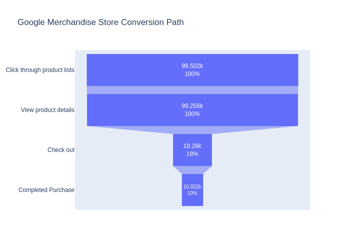
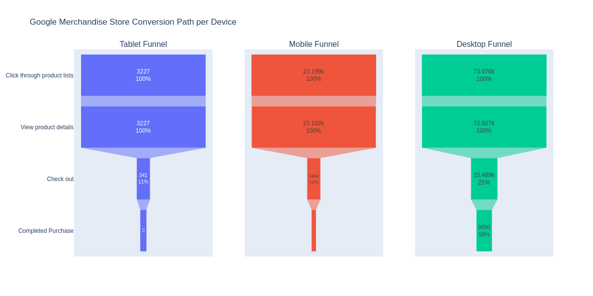
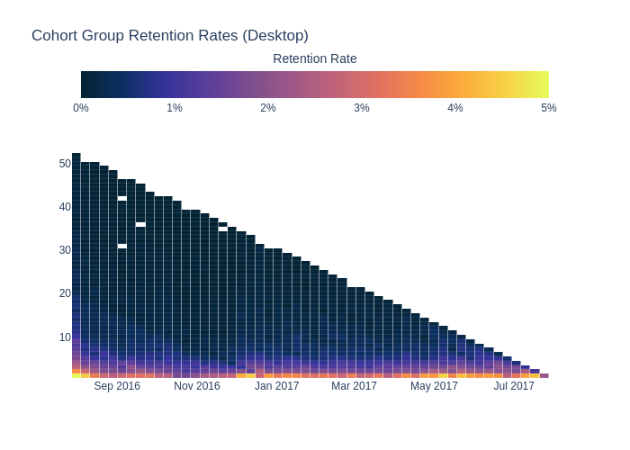
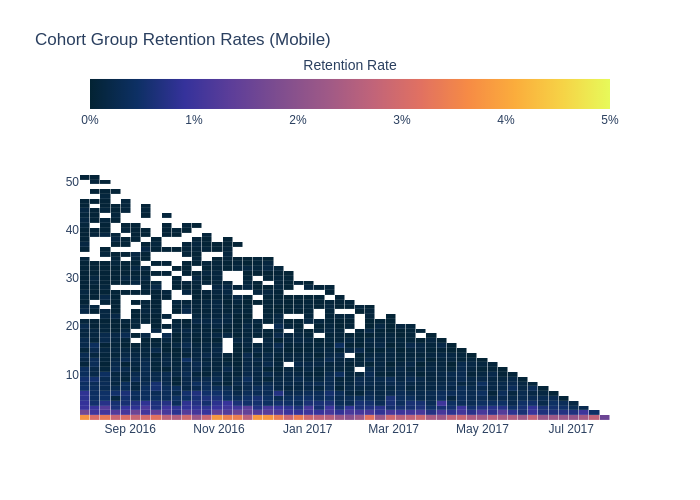

<h1 align="center" style="margin-bottom:0;">Google Analytics Retention & Funnel Analysis</h1>
<p align="center" style="font-size:1.2rem; margin-top:4px;">
A KPI-Driven Exploration of User Behavior, Conversion Efficiency, and Retention Dynamics
</p>


This project analyzes Google Analytics session-level data (from Google’s public BigQuery sample dataset) to understand how users progress through an e-commerce funnel and how effectively the site retains users over time. The objective is to apply core data analyst techniques: funnel modeling, segmentation, retention cohort analysis, and KPI development-to uncover insights that directly support product, UX, and marketing decisions.

This project demonstrates end-to-end analytical skills, from SQL data modeling to KPI definition, visualization, and interpretation.

## Project Objectives

- **Model the full e-commerce funnel** (Product Views → Add-to-Cart → Checkout → Purchase) to quantify stage-to-stage drop-off.

- **Define and calculate key performance indicators (KPIs)** including:

  - Conversion Rate
  - Cart-to-Purchase Ratio
  - Product View Rate
  - Average Transactions per User

  - Session Value Metrics by Traffic Channel

- **Segment funnel and retention patterns** by:

  - Device category (mobile, desktop, tablet)

  - Traffic acquisition channel

- **Conduct cohort-based retention analysis** to evaluate long-term user engagement.

- **Translate analytical findings into actionable recommendations** tied to user experience, merchandising, and acquisition strategy.

## Data Source

This project uses Google’s public Google Analytics sample data hosted in BigQuery:
`bigquery-public-data.google_analytics_sample.ga_sessions_*`

The dataset includes session-level information such as pageviews, device details, marketing channel, e-commerce events, and nested hit-level actions.

Data documentation: [Link](https://support.google.com/analytics/answer/3437719?hl=en)

## Analytical Focus
### 1. KPI Computation

Using SQL and Python, the project computes essential KPIs used by data analysts and product teams, including:

- Conversion Rate:
```math
Conversions÷Sessions
```
- Cart-to-Purchase Ratio:
```math
Purchases÷Add-to-Cart Sessions
```

- Product View Rate:
```math
Users Who Viewed Product÷Total Sessions
```
- Average Transactions per User

These metrics establish the baseline performance of the e-commerce flow.

---

### 2. Funnel Analysis

A structured funnel examines how users progress across key stages:

View Product → Add to Cart → Checkout → Purchase

The notebook includes:

- A **general funnel** overview



- Segmented **funnels by device category**



These expose where the highest drop-offs occur and which user groups experience the most friction.

---

### 3. Traffic Channel Performance

A dedicated section highlights how acquisition channels vary in:

- Session volume

- Revenue generated

- Conversion efficiency

- Engagement (pageviews per session)

This analysis identifies high-value channels (e.g., CPC/CPM) and channels with traffic-to-revenue misalignment (e.g., affiliate).

---

### 4. Retention Cohort Analysis

Weekly cohorts are created from first-session dates to examine:

- Week-over-week retention

- Device-specific retention patterns

- Where long-term engagement breaks down

#### Device-Level Retention Heatmaps



Heatmaps visualize retention curves and highlight which devices drive the strongest return behavior.

## Key Insights (High-Level)

- The most significant drop-off in the funnel occurs between **Product Detail** and **Checkout**, suggesting UX friction or unclear purchase intent.

- **Mobile users** show lower conversion and retention, indicating an opportunity for targeted UI simplification.

- **Referral and affiliate channels** bring traffic but underperform in conversion and revenue, while CPM/CPC channels demonstrate high efficiency.

- **Desktop** and **mobile cohorts** show meaningful long-term retention, making them priority targets for improvements.

## Recommendations

Based on funnel patterns, traffic performance, and cohort retention:

- Prioritize UX improvements at the **Product Detail** → **Checkout** transition.

- Test simplified mobile product pages and evaluate retention improvements.

- Investigate device-switching or abandonment behaviors using supplemental UX data.

- Review the affiliate channel for targeting misalignment or attribution issues.

These recommendations are tied directly to improving **conversion efficiency** and **long-term retention**, the two central KPIs of the project.

## Tools & Technologies

- **SQL** (BigQuery)

- **Python** (Pandas, NumPy, Seaborn/Matplotlib, Plotly)
